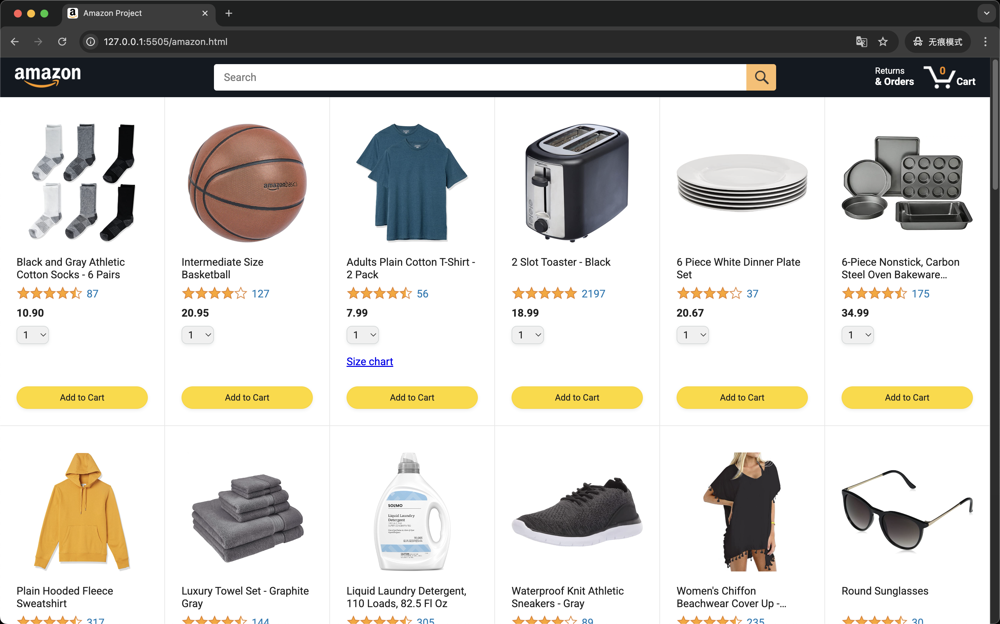
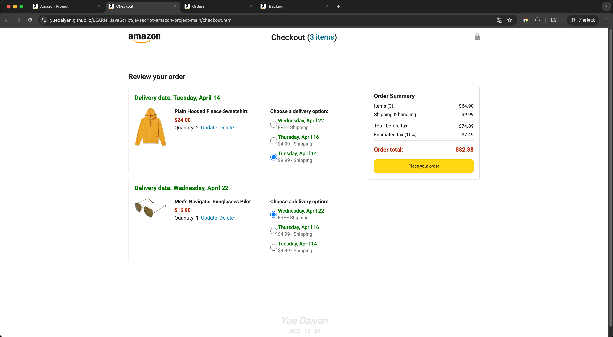
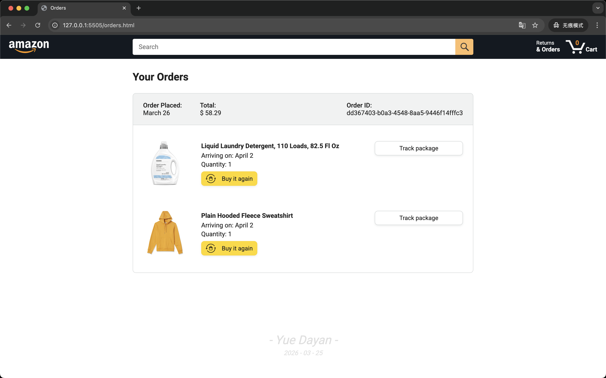
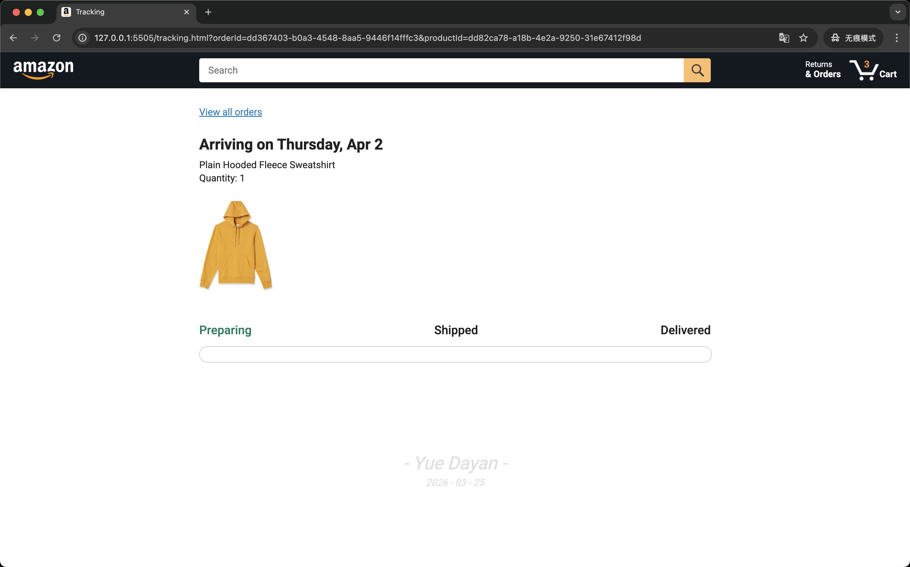
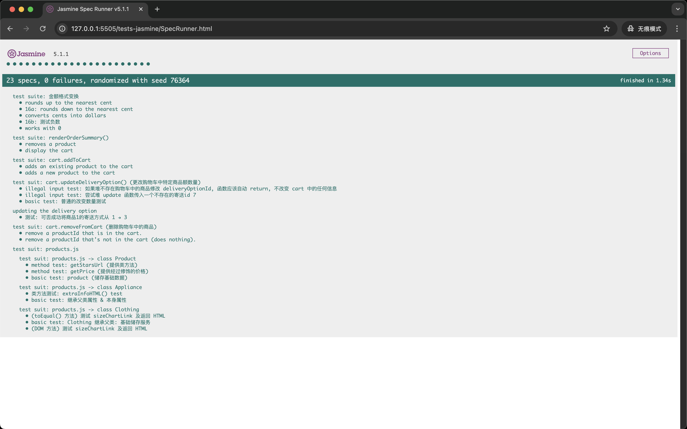

# Javascript Practice: YouTube Clone

This repository documents my journey learning JavaScript, including assignments and a final project. 
The curriculum focuses on DOM tree generation and interaction, and covers procedural programming, object-oriented programming, Jasmine testing framework, backend development, and asynchronous patterns (async functions, fetch, XML, await, etc.), all following industry-level coding standards throughout.

<small>本仓库记录了我学习 JavaScript 课程的过程，包括作业与最终项目。
此次学习聚焦于 DOM 树的生成与交互，并包括过程式编程、面向对象编程、Jasmine 测试框架应用、后端、异步(async function()、fetch()、XML、await function()……)，并在全过程遵循企业级代码规范。</small>

##  Final Project
* **File Path:** `/javascript-amazon-project-main/amazon.html`
* **Best Viewed In:** Google Chrome

        

[page 1 amazon.html](https://yuedaiyan.github.io/LEARN_JavaScript/javascript-amazon-project-main/amazon.html)

        

[page 2 checkout.html](https://yuedaiyan.github.io/LEARN_JavaScript/javascript-amazon-project-main/checkout.html)

        

[page 3 orders.html](https://yuedaiyan.github.io/LEARN_JavaScript/javascript-amazon-project-main/orders.html)

        

[page 4 tracking.html](https://yuedaiyan.github.io/LEARN_JavaScript/javascript-amazon-project-main/tracking.html)

        

[Jasmine Test Framework](https://yuedaiyan.github.io/LEARN_JavaScript/javascript-amazon-project-main/tests-jasmine/SpecRunner.html)

##  Resources & Credits
* **Course Video:** [JavaScript Tutorial Full Course - Beginner to Pro](https://www.youtube.com/watch?v=EerdGm-ehJQ&t=61267s)
* **Assignments:** [Course Repository](https://github.com/SuperSimpleDev/javascript-course)
* **Reference Example:** [Live Demo](https://supersimple.dev/exercises/amazon/)

---
*Completed as part of my Front-End development learning journey.*